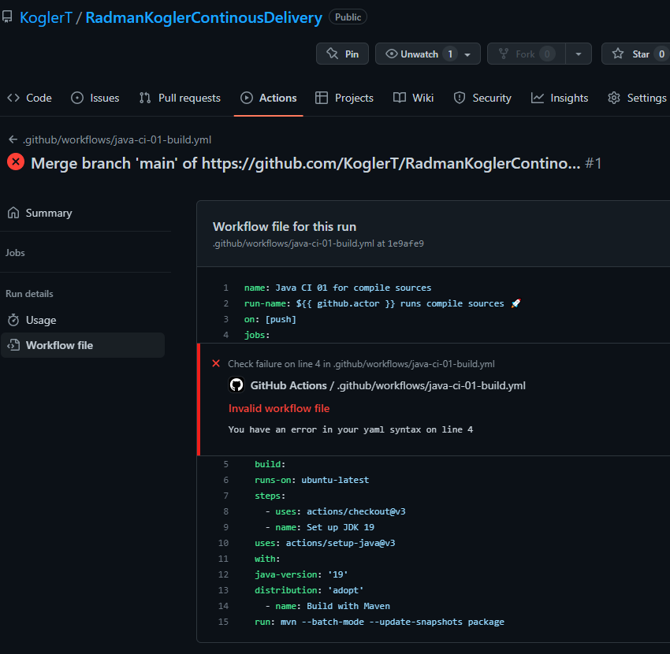

# Calculator Example 1.2 

Upgraded, tested and cleaned for Continuous Delivery Pipeline testing

## Installation

no special installation needed, currently upgraded Tools Version for 1.2
- Maven 3.8.6
- JDK 19.0.1

```bash
mvn clean
```

## Usage

```bash
mvn test
```

## Contributing

Pull requests are welcome. For major changes, please open an issue first
to discuss what you would like to change.

Please make sure to update tests as appropriate.

## License

[GNU GPLv3](https://choosealicense.com/licenses/gpl-3.0/)

## Documentation

### Die ersten Schritte

    IDE und Java updated. Pathvariable neu setzten und verwendete java version mit pom.xml abgleichen.
    project laden
    ordnersturcture für worklflows anlegen
        .github/workflows
        .yml datei erstellen
    beim kopieren der .yaml file sind einrückungsfehler entstanden -> diese wurden gelöst

## Java-CI-01

### (optional) Überlegen Sie sich, wie Sie die einzelnen Schritte (compile und test) separat als steps abbilden können. Wäre das vorteilhaft? Begründen Sie Ihre Antwort.


