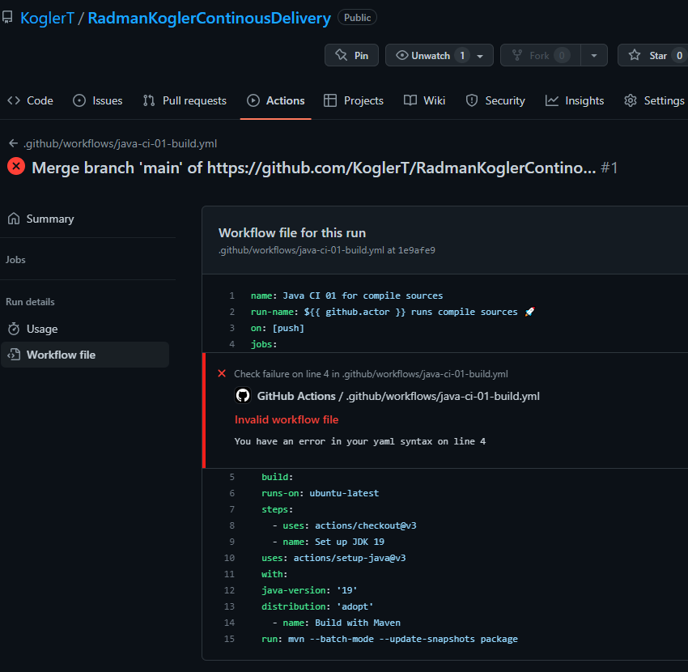
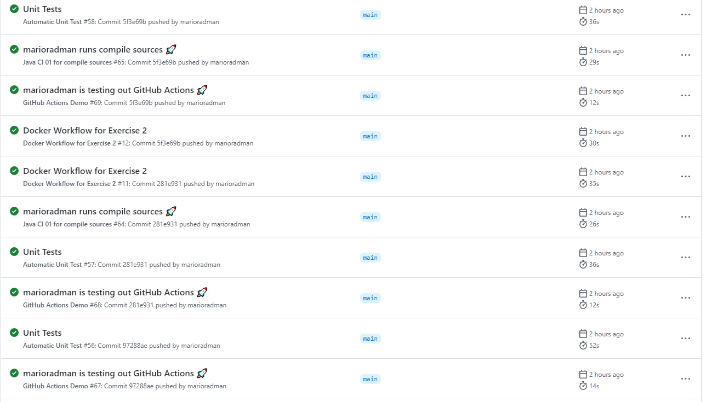
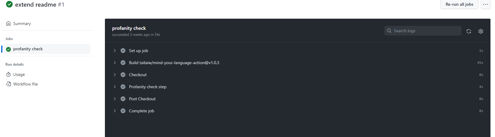

# Task 01

## Installation
    IDE und Java updated. Pathvariable neu setzten und verwendete java version mit pom.xml abgleichen.
    project laden
    ordnersturcture für worklflows anlegen
        .github/workflows
        .yml datei erstellen
    beim kopieren der .yaml file sind einrückungsfehler entstanden -> diese wurden gelöst

## ÜBUNGSTEIL 1 – ERSTE PIPELINE

Die ersten Pipelines wurden erstellt:
[Demo](../.github/workflows/demo.yml)
[Compile/Build Pipeline](../.github/workflows/java-ci-01-build.yml)

Das Aufsetzen und herumexperimentieren hat seine Zeit gekostet, aber am Ende hat alles funktioniert.

## ÜBUNGSTEIL 2 – PACKAGES DEPLOYEN

Damit Packages deployed werden können, werden zusätzliche Pipelines benötigt.
(alternativ wäre auch ein implementierung in eine existierende möglich, dies was aber nicht die Aufgabenstellung)

[Package Deployment Pipeline](../.github/workflows/java-ci-02-build.yml)

## ÜBUNGSTEIL 3 – WEITERE GITHUB ACTONS FINDEN

Zum Schluss haben wir uns detaillierter mit weiteren Actions/Workflows im Marketplace beschäftigt.
Dazu haben wir eine neue Pipeline erstellt für den Chekstyle.

[Checkstyle Pipeline](../.github/workflows/java-ci-04-build.yml)

In Summe kann man nun sehen welche Pipelines alles nun funktionieren.

## ÜBUNGSTEIL 4 – WORKFLOWS FÜR IHR EIGENES BEISPIELPROJEKT
Es wurde ein neuer github workflow erstellt: `Mind your language`
Dieser erkennt wenn in Kommentaren (z.B. Pull Request, neue Issues) eine obszöne bzw. nicht angemessene Sprache verwendet wird und versendet warnungen.

### Aufbau des Workflows
Der Workflow ist in mehrere Teile aufgebaut:
1. Auslöser (issues, issue-comment, pr-comment)
2. Macht einen profanity check auf den text und führt die action aus

### Workflow in Actions

### Github Action und Sources
- https://github.com/marketplace/actions/mind-your-language
- https://github.com/tailaiw/mind-your-language-action

## Übungsfragen

### Wie können CI/CD Pipelines uns dabei unterstützen CI Anti-Patterns zu vermeiden?
Durch automatisierte Testung wird die gefahr der Anti Patterns verringert.
Durch einführung der Github Actions können Defects früh erkannt werden.

Zum Beispiel. Diese Antipattern werden mit unseren worflows vermieden

Sending minimal feedback that provides
no insight into the build failure or is nonactionable. Sending too much feedback,
including to team members uninvolved with
the build. This is eventually treated like spam,
which causes people to ignore messages.

Relying on IDE settings for Automated Build.
Build cannot run from the command line

### Wie weit kann Continuous Integration mit der aktuellen Übung erfüllt werden? Begründen Sie Ihre Antworten.
Continous Integration kann mit dieser Übung erfüllt werden. Mann muss sich nur überlegen welche Actions man braucht um
gewisse Anforderungen, die man an sein Projekt hat zu erfüllen