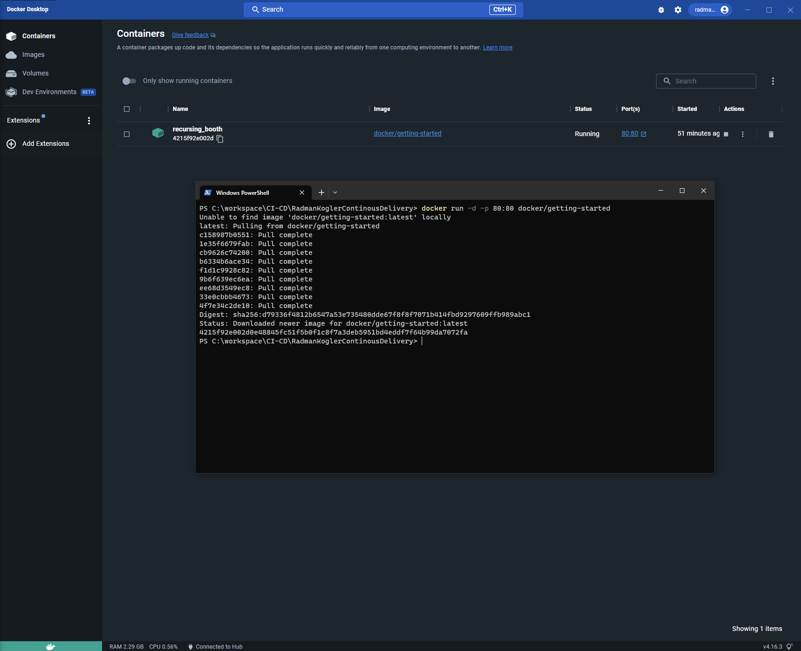
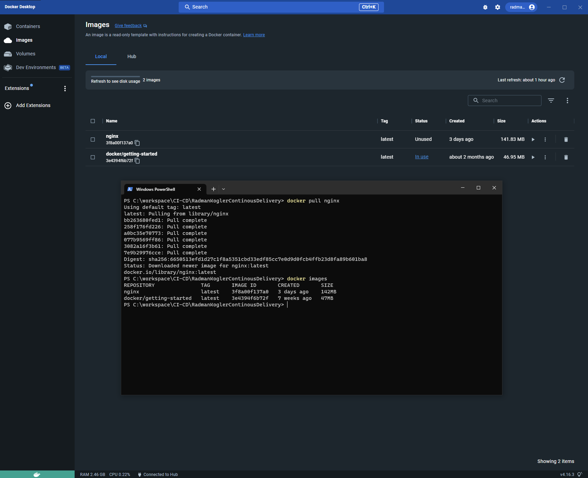
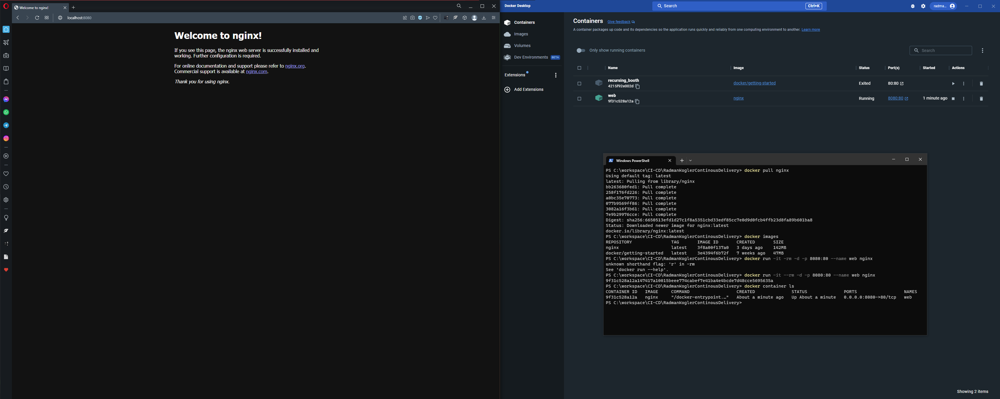
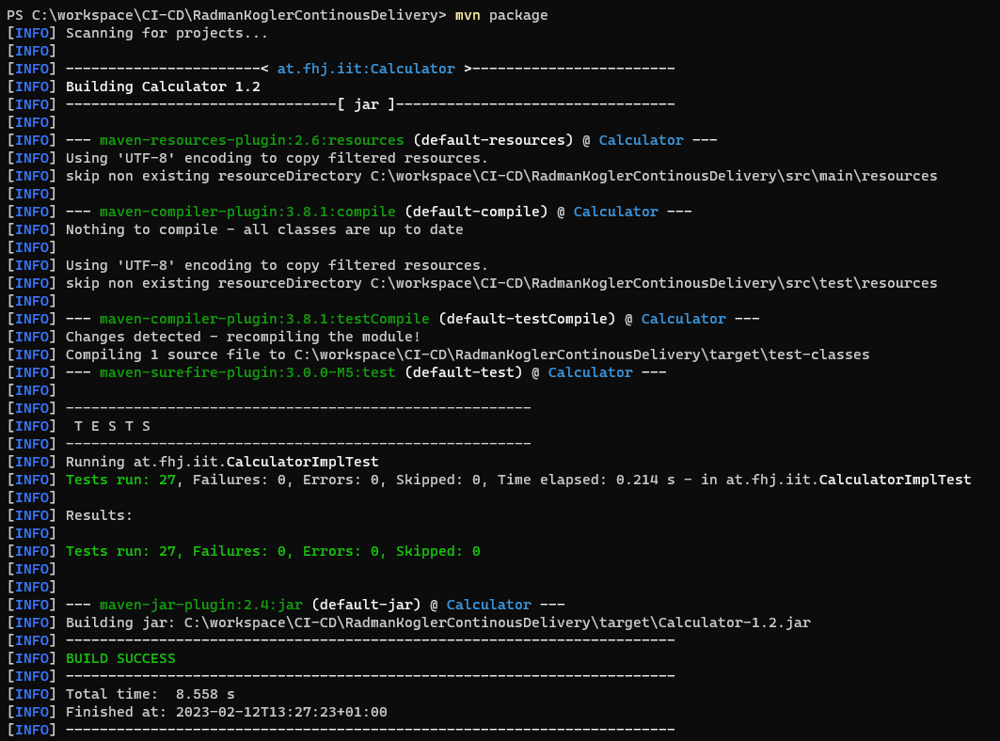
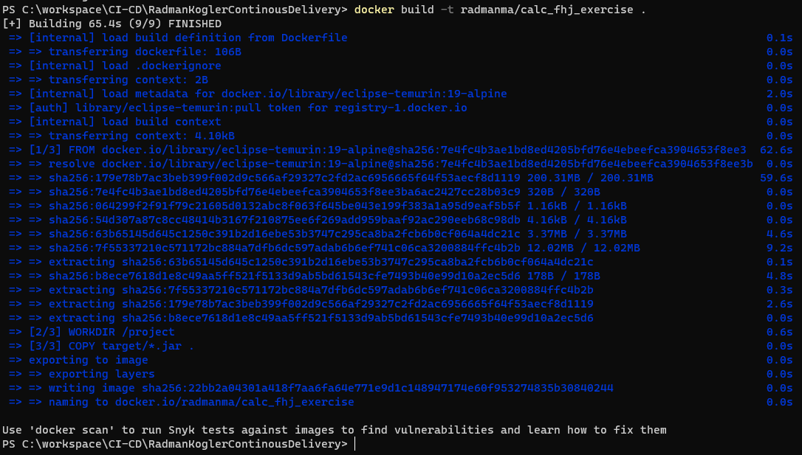
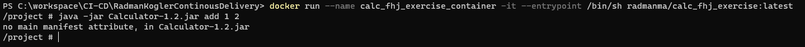
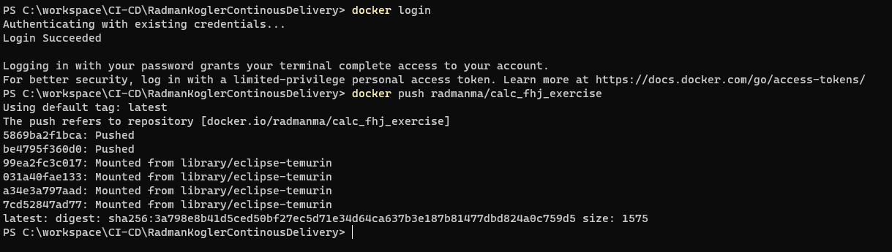

# Übungsaufgabe 2

Containerization mit Docker und Integration in die CD Pipeline

Verwendet wurde das Konto von Mario Radman (radmanma), da er schon ein eigenes Enterprise Docker-Konto besitzt.

## Übungsteil 1 - Docker installation
_**Docker wurde erfolgreich installiert und Beispielcontainer gestartet._**

## Übungsteil 2 - Docker Hub Images / Parent Images
_**Nginx image heruntergeladen und in docker gestartet._**

nginx image von dockerhub herunterladen  
`docker pull nginx`

alle verfügbaren images anzeigen  
`docker images`

nginx container mit dem image starten  
`docker run -it --rm -d -p 8080:80 --name web nginx`

container anzeigen  
`docker container ls`

## Übungsteil 3 - Dockerfile
**_Das Beispielprojekt konfigurieren, sodass docker images erstellen kann. Es soll eine jvm-image herunterladen und
verwenden. Das Image wird dann in dockerhub hochgeladen._**

Konfigurationsdatei:
[Dockerfile](../Dockerfile)

JAR erzeugen  
`mvn package`

Image erzeugen  
`docker build -t radmanma/calc_fhj_exercise .`

Docker Container starten und antesten. In unserem Fall gibt es wegen fehlender implementierung einen erwarteten Fehler.  
`docker run --name calc_fhj_exercise_container -it --entrypoint /bin/sh radmanma/calc_fhj_exercise:latest`

Docker image in dockerhub hochgeladen. Daraufhin wurde es getestet und hat funktioniert.  
`docker login`  
`docker push radmanma/calc_fhj_exercise`

## Übungsteil 4 - Pipeline erweitern

Die Pipeline wurde mit [einem neuen Workflow](../.github/workflows/exc2-docker.yml) erweitert.
Dazu mussten auch die Secrets in den github-actions-secrets in den repo-settings hinzugefügt werden.

Das Workflow funktioniert auch wie man sieht:
